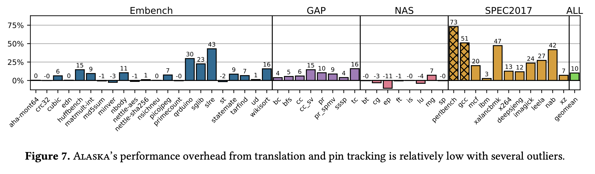
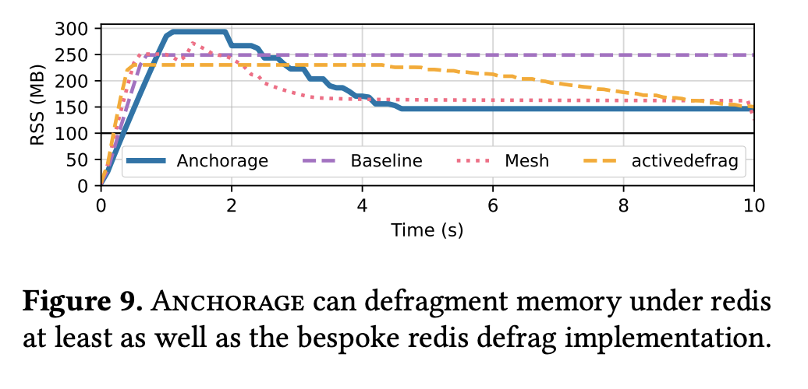
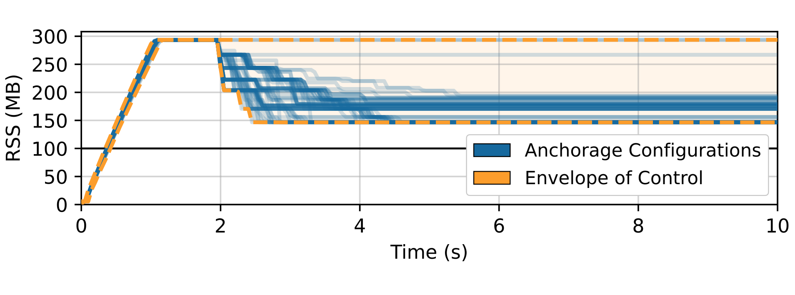
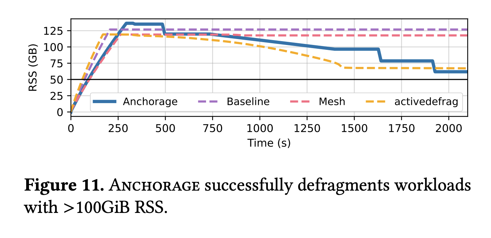
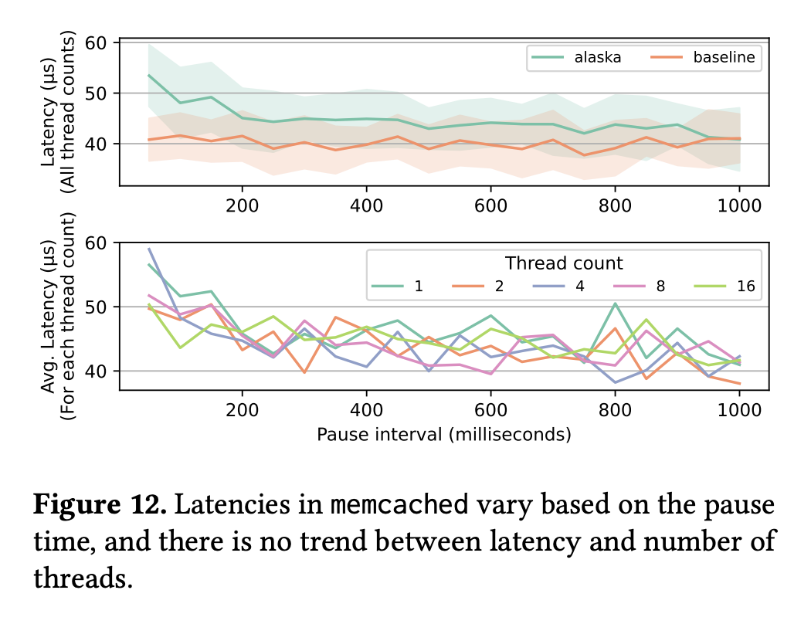

# Alaska ASPLOS'24 Aritfact

This repository serves as an artifact for the ASPLOS'24 paper "Getting a Handle on Unmanaged Memory" by Nick Wanninger, Tommy McMichen, Simone Campanoni, and Peter Dinda.

This artifact contains the following components:

- The Alaska compiler (`./alaska/compiler/`)
- The Alaska runtime (`./alaska/runtime/`)
- Evaluation and plotting scripts to *automatically* recreate the experimental results from the paper.
- Example results from our paper and other runs (`./example-results/`)


## What is Alaska?

Managed languages such as Java or C# have long enjoyed the ability to relocate memory to compact and defragment their heap freely.
Alaska is a new compiler and runtime which empowers *unmanaged* languages with the ability to relocate heap objects freely.
It does this through a level of indirection known as *handles*.

As a compiler, Alaska enables **unmodified** applications written in languages like C or C++ to utilize handles.
It then boasts an extendable runtime interface, on top of which we implement *anchorage*.
Anchorage is a custom memory allocator which, using handles, can defragment memory in these unmodified applications.

For more info, the Alaska paper can be found in this repo [here](paper.pdf).

## System Requirements

This artifact has been evaluated on a series of x86 machines, all running linux.
While most distributions should work, we recommend Ubuntu 22.04, but we have also evaluated on various versions of RHEL.

We support (and recommend) evaluating the artifact in a docker/podman container.
Installation instructions for Ubuntu can be found [here](https://docs.docker.com/engine/install/ubuntu/).

If run outside of a docker/podman container, we find these dependencies sufficient:

```bash
sudo apt install \
  build-essential \
  git \
  python3 python3-pip python3-virtualenv \
  python2 \
  sudo \
  libxml2 \
  cmake \
  wget \
  libunwind-dev \
  file \
  default-jre \
  autotools-dev \
  automake \
  pkg-config \
  openssl \
  libevent-dev
```


One of the tools requires python [type annotations](https://docs.python.org/3/library/typing.html), which older versions of python 3 does not support.
The Ubuntu 22.04 repos provide Python 3.10, which is sufficient.

Internet access is required to generate the artifact (to download benchmarks, etc).

# The benchmarks

This artifact uses four major benchmark suites.
Three of them are open source (Embench, GAP, and NAS), but SPECCPU 2017 is not.
The three open source benchmarks are automatically downloaded for you, but SPEC is not--per their license.
If you have a SPEC license, place the source code tarball in any of the following locations: `./SPEC2017.tar.gz`, `~/SPEC2017.tar.gz`, or `/SPEC2017.tar.gz`.
If you do not have SPEC, the artifact will run correctly, but will simply not evaluate Alaska against SPEC.
This will only affect figures 7 and 8.

This artifact also uses two open source applications: `redis` and `memcached`.
The artifact will automatically clone, build, and run these applications for you.


# Generating the artifact

The benchmarks run in this artifact take many hours to complete, especially if you are benchmarking SPECCPU (choosing the spec `ref` size can take up to two days to execute).
We *HIGHLY* recommend running all of the commands in a tmux or screen session to avoid SSH connectivity problems interrupting the artifact.

While not required, we support running the artifact in a container which has all dependencies pre-arranged with the following command:

```bash
make in-docker
# -- or --
make in-podman # We recommend this over docker
```

This command will spawn an ephemeral container with the artifact's directory mounted as a bindmount.
Running commands in this container will affect the host filesystem, and results will be visible in `./results/`.


**NOTE:** Unfortunately, if using docker, files created while running in a bind-mount will be owned by root.
To delete these files (such as the results or compiled binaries), simply run `make distclean` from within the docker container context.
As such, we recommend `podman` instead, which does not have this problem

The creation of the figures is done with one command:

```bash
./run_all.sh
```


This script will prompt you to answer a few questions, download dependencies, compile, and generate all the figure PDFs that are requested.
The results can be found in the folder, `results/`, and they include the raw CSV data, as well as the resultant figures.

If SPEC is found, it runs at the `ref` size by default.
With the default size, this artifact can take upwards of two days to run.
**If you wish to run with a smaller size, adjust the above command as follows:**


```bash
# Run the smallest size (test)
SPEC_SIZE=test ./run_all.sh
# -- or --
# Run the 'medium' size (train)
SPEC_SIZE=train ./run_all.sh
```

We recommend choosing `train` as a *minimum* size, as `test` does not run for long enough in many benchmarks.


**NOTE**: We highly recommend running this command within a TMUX session, as the artifact can take up to a day to execute, especially with SPEC enabled.


This script will also generate two configurations for `alaska`:

- **noservice**: Alaska, where `malloc` is used as an allocator backend.
- **anchorage**: The main service for the paper, which provides defragmentation in C programs.

These are compiled using the source code of alaska, which can be found in `alaska/`.


# Using Alaska

Alaska is designed to be as easy as possible to use on existing codebases.
If you source either of the enable scripts in `opt/`:
```bash
# Add the anchorage version of alaska to your path
source opt/enable-alaska-anchorage
```
you can freely compile C or C++ programs using `alaska` as a drop-in replacement for `clang` or `gcc`:
```bash
alaska -O3 foo.c -o foo
```
The resulting binary will transparently utilize alaska, and in this case will automatically defragment memory using anchorage.


# Expected Figures

Below is a listing of the figures this artifact automatically generates.

**NOTE:** Because Alaska has a tendancy to insert memory operations into the critical path of some applications, expect performance overheads to be somewhat different than ours.
Some applications are highly sensitive to changes in cache hierarchies, numa setups, and system/os noise.
See the example results in the `example-results/` folder for a few examples of this (especially in the embench suite).

## Figure 7 - Evaluating Alaska's Overhead



This figure evaluates the overhead of Alaska's handles on a bevy of benchmarks across several benchmarks suites.
The plot shows the overhead (% increase in runtime) for each benchmark.

**NOTE:** You will not see SPEC2017 listed in your result if the `run_all.sh` script could not find the `SPEC2017.tar.gz` file.
GCC and Perlbench in the SPEC suite are evaluated slightly different, as they violate strict aliasing requirements described in [section 3.2 of our paper](paper.pdf).
As such, these benchmarks have "hoisting" disabled to ensure correctness.


## Figure 8 - Evaluating Alaska's Optimizations


This figure is an ablation study of alaska's feature set.
It includes the same performance overheads from the SPEC suite in figure 7, but includes measurements where the hoisting optimization is disabled, as well as if we disable the pin tracking transformation.
GCC and Perlbench are omitted from this test, as they have the hoisting optimization off already.

**NOTE:** This figure will be empty (or not generated) if `SPEC2017.tar.gz` could not be found on your system.

## Figure 9 - Evaluating Anchorage's Defragmentation




This figure is what we believe to be the main contribution of Alaska.
The intended takeaway is that Alaska is able to, through transparent object mobility in an unmanaged language, defragment memory in large real-world applications.
In particular, we test Alaska+Anchorage on Redis, a well known open-source key value database which is known to suffer from fragmentation.

The test is to insert keys into a redis database where it is configured to evict keys according to an LRU policy once memory usage goes above 50GB.
This eviction is relatively random, which creates holes in the heap, leading to significant fragmentation.

The baseline bar (purple) shows that without a specialized allocator redis cannot achieve the 100mb target and uses 250MB.
Anchorage (this work) in blue is able to reduce the memory usage down to about 150MB through defragmentation.

**NOTE:** You should not expect it to achieve 100MB, despite that being the target for LRU eviction.
This is due to the LRU policy not considering allocator overheads.

Redis boasts a built-in defragmentation policy, activedefrag, shown in yellow.
Activedefrag and Mesh (prior work, shown in red) are able to reduce memory usage to a similar degree as Anchorage.


## Figure 10 - Evaluating Anchorage's Control Algorithm




This figure evaluates anchorage's control algorithm, which can be configured by the user with various aggressiveness, overheads, and target fragmentation parameters.
The test sweeps many parameter configurations and plots them as the blue lines, indicating that Anchorage can be tuned to fit with whatever requirements are required.


## Figure 11 - Evaluating Anchorage's Scalability


To produce this figure:



This figure tests how alaska manages to defragment large-memory workloads.
This test is very similar to that of figure 9, except instead of 100mb, Redis is configured to use a maxmum of 50GB.


**NOTE:** Mesh is not included in the artifact version of this figure, as it requires a patch to allocate more than 64GB of memory.
It, however, has trouble defragmenting memory in this environment, as visible in the above figure.

**NOTE:** This test is subject to a decent amount of randomness, and it is entirely possible the reduction in memory usage by defragmentation is more or less than the above figure.

## Figure 12 - Evaluating Alaska's effect on Multithreaded Workloads



This figure presents an evaluation of alaska's stop-the-world movement's effect on latency in a multithreaded memcached application.
The top half of the figure shows that there is only a considerable effect on latency if pauses occur more often than every 200ms (which is rare in our evaluation).
The bottom half shows that the number of threads shows no correlation with the latency, indicating that our stop-the-world system scales.

