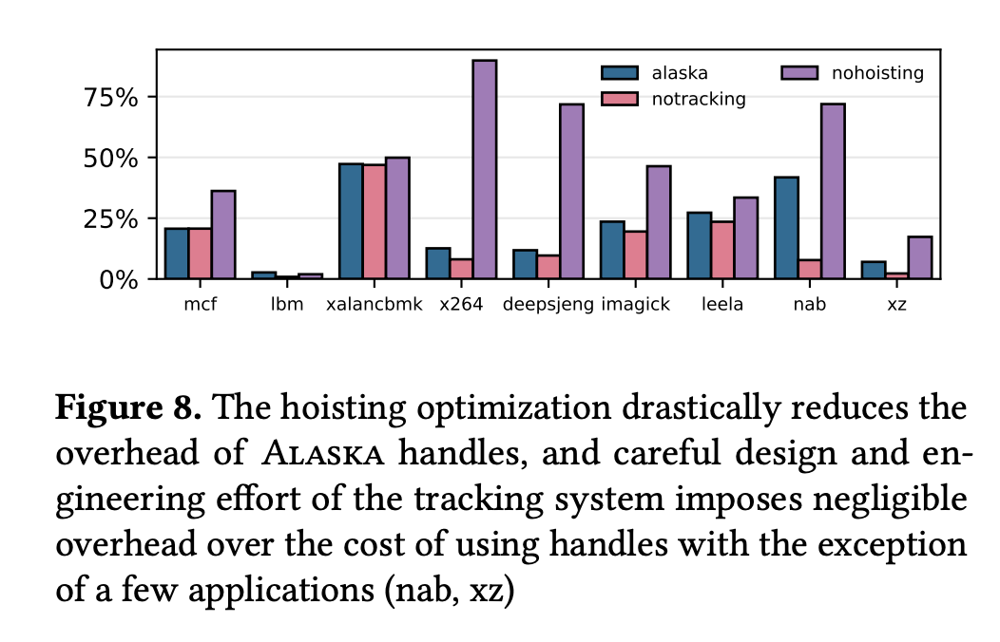

# Alaska ASPLOS'24 Aritfact

The Alaska paper can be found [here](paper.pdf).

## System Requirements

This artifact has been evaluated on a series of x86 machines, all running linux.
While most distributions should work, we recommend Ubuntu 22.04, but we have also evaluated on various versions of RHEL.

We find these dependencies sufficient:

```bash
sudo apt-get install -y \
  build-essential \
  git \
  python3 python3-pip python3-virtualenv \
  sudo \
  libxml2 \
  cmake \
  wget \
  zlib1g-dev \
  libunwind-dev \
  file \
  default-jre
```

Internet access is required to generate the artifact (to download benchmarks, etc).

# The benchmarks

This artifact uses four major benchmark suites.
Three of them are open source (Embench, GAP, and NAS), but SPECCPU 2017 is not.
The three open source benchmarks are automatically downloaded for you, but SPEC is not--per their license.
If you have a SPEC license, place the source code tarball in any of the following locations: `./SPEC2017.tar.gz`, `~/SPEC2017.tar.gz`, or `/SPEC2017.tar.gz`.
If you do not have SPEC, the artifact will run correctly, but will simply not evaluate Alaska against SPEC.
This will only affect figures 7 and 8.

## Generating the artifact

The benchmarks run in this artifact take many hours to complete, especially if you are benchmarking SPECCPU.
As such, we recommend 
The creation of the figures is done with one command:
```bash
make artifact
```
The results can be found in the folder, `results/`, and they include the raw CSV data, as well as the resultant figures.


This will download the required version of LLVM, and the whole-program bitcode abstracton tool [`gllvm`](https://github.com/SRI-CSL/gllvm).
Using these tools, it will then compile `alaska` into two configurations:

- **noservice**: Alaska, where `malloc` is used as an allocator backend.
- **anchorage**: The main service for the paper, which provides defragmentation in C programs.

These are compiled using the source code of alaska, which can be found in `alaska/`.

## Using Alaska

Alaska is designed to be as easy as possible to use on existing codebases.
If you source either of the enable scripts in `opt/`:
```bash
# Add the anchorage version of alaska to your path
source opt/enable-alaska-anchorage
```
you can freely compile C or C++ programs using `alaska` as a drop-in replacement for `clang` or `gcc`:
```bash
alaska -O3 foo.c -o foo
```
The resulting binary will transparently utilize alaska, and in this case will automatically defragment memory using anchorage.


# Expected Figures

Below is a listing of the figures this artifact automatically generates.


## Figure 7

To produce this figure:
```bash
make results/figure7.pdf
```


This figure constitutes the main claim in our paper.
It is an overhead measurement of alaska on four benchmark suites.


## Figure 8

To produce this figure:
```bash
make results/figure8.pdf
```



This figure is an ablation study of alaska's feature set.
It includes the same performance overheads from the SPEC suite in figure 7, but includes measurements where the hoisting optimization is disabled, as well as if we disable the pin tracking transformation.

## Figure 9

To produce this figure:
```bash
make results/figure9.pdf
```


This figure presents alaska's ability to defragment memory on an unmodified copy of redis.
This artifact only automatically generates the 'anchorage' line, so you will not see Mesh or activedefrag in your results.


## Figure 11


## Figure 12

To produce this figure:
```bash
make results/figure12.pdf
```


This figure presents an evaluation of alaska's stop-the-world movement's effect on latency in a multithreaded memcached application.
The top half of the figure shows that there is only a considerable effect on latency if pauses occur more often than every 200ms (which is rare in our evaluation).
The bottom half shows that the number of threads shows no correlation with the latency, indicating that our stop-the-world system scales.

